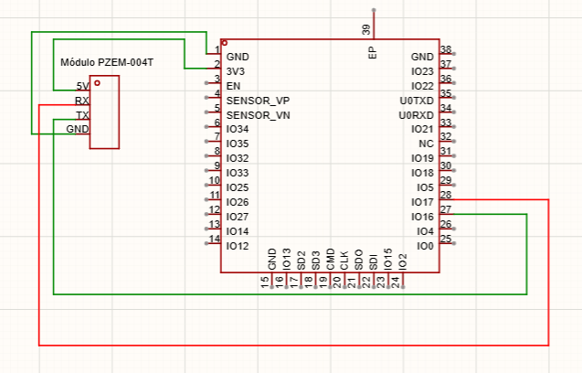
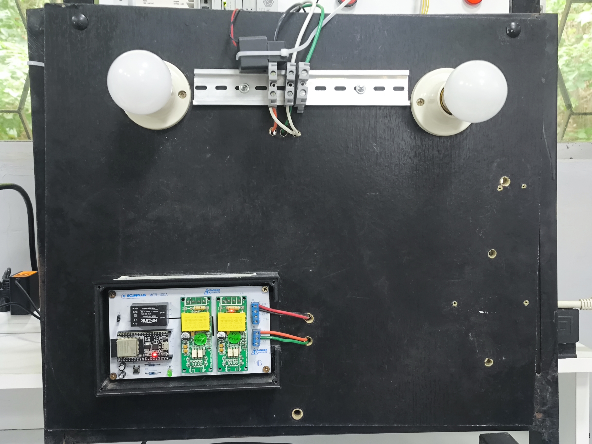
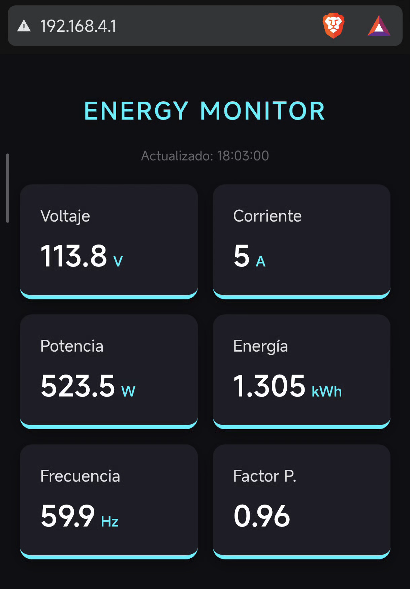

# Monitoreo y análisis de variables eléctricas con ThingSpeak y MATLAB Online

## 1. Descripción general
El proyecto consiste en el diseño y desarrollo de un sistema integral de Internet de las Cosas (IoT) enfocado en el monitoreo en tiempo real de variables eléctricas. La arquitectura se fundamenta en la integración de hardware y software para capturar, procesar, transmitir y analizar datos como voltaje, corriente, potencia, energía, frecuencia y factor de potencia.

## 2. Problema que resuelve
El desconocimiento del consumo eléctrico en tiempo real limita la eficiencia energética y la detección de anomalías. Este proyecto resuelve este problema al ofrecer una supervisión inmediata (cada dos segundos) a nivel local mediante una red propia, garantizando al mismo tiempo el almacenamiento histórico en la nube (cada veinte segundos) para auditorías y análisis de datos.

## 3. Objetivos
* Capturar datos eléctricos precisos utilizando el módulo PZEM-004T.
* Establecer una conectividad robusta mediante un modo de red híbrido en el ESP32.
* Desplegar una interfaz gráfica local asíncrona ("Power Dash v2") para la lectura inmediata de datos.
* Transmitir paquetes de datos consolidados a la plataforma ThingSpeak para su posterior análisis.

## 4. Arquitectura de la solución IoT
* **Capa de Percepción (Hardware):** Lectura de variables eléctricas a través del sensor PZEM-004T y el transformador de corriente.
* **Capa de Red (Edge):** Procesamiento en el microcontrolador ESP32 y generación de red híbrida (punto de acceso local + conexión a internet).
* **Capa de Aplicación (Nube/Local):** Servidor web asíncrono para el dashboard local y envío de datos a la API de ThingSpeak.

## 5. Componentes de hardware utilizados
* Microcontrolador ESP32 (Procesamiento lógico y conectividad Wi-Fi).
* Módulo Sensor Multímetro PZEM-004T Versión 3.0.
* Transformador de Corriente (CT) tipo dona (10A/100A).
* Cables Jumper (Macho-Hembra / Macho-Macho).
* Cable de alimentación y datos USB.
* Cables de Corriente Alterna (AC) y Enchufe (110V/220V).
* Carga Eléctrica de prueba (Foco, ventilador, etc.).

## 6. Componentes de software utilizados
* Entorno de Desarrollo de Arduino (C++).
* Librería `WiFi.h`: Gestión de red híbrida.
* Librería `HTTPClient.h`: Peticiones HTTP GET.
* Librería `PZEM004Tv30.h`: Protocolo de comunicación con el sensor.
* Librería `AsyncTCP.h`: Base de comunicación TCP asíncrona.
* Librería `ESPAsyncWebServer.h`: Servidor HTTP interno del ESP32.

## 7. Tecnologías de comunicación implementadas
* Comunicación Serial (UART) entre el sensor y el ESP32.
* Wi-Fi en modo AP (Access Point) y STA (Station).
* Protocolo HTTP para el consumo de la API REST y el servidor web asíncrono.

## 8. Plataforma IoT empleada
* **ThingSpeak:** Utilizada para la recepción, almacenamiento y graficación continua de las variables eléctricas en la nube.
* **MATLAB Online:** Utilizada para el análisis estadístico avanzado y visualización de la información extraída de ThingSpeak.

## 9. Diagrama de conexión o arquitectura

*(Asegúrate de subir la imagen del diagrama a la carpeta /Esquemas)*

## 10. Fotografías del prototipo

*(Asegúrate de subir la foto física del circuito a la carpeta /Imagenes)*

## 11. Capturas del dashboard

*(Asegúrate de subir las capturas correspondientes a la carpeta /Imagenes)*

## 12. Video de Explicación
Puedes visualizar el video de expliacion a través del siguiente enlace:
[Ver funcionamiento del proyecto en YouTube](https://youtu.be/QrXB0DKhQPo?si=GoQaYMfKtWGx9RAQ).

## 13. Instrucciones de instalación
1. Clonar el repositorio oficial de la asignatura: `git clone https://github.com/ti-pucese/internet-de-las-cosas.git`.
2. Instalar el paquete de tarjetas ESP32 de Espressif Systems en Arduino IDE.
3. Instalar la librería `PZEM004Tv30` desde el Gestor de Bibliotecas.
4. Descargar e instalar manualmente (en formato ZIP) las librerías `AsyncTCP` y `ESPAsyncWebServer` desde sus repositorios oficiales en GitHub.

## 14. Instrucciones de configuración
Para replicar el funcionamiento, se deben configurar los siguientes parámetros en el código principal:
* **Credenciales Wi-Fi (Líneas 10-11):** Cambiar `wifi_ssid` y `wifi_pass` por los datos de la red local con acceso a internet.
* **Credenciales Punto de Acceso (Líneas 12-13):** Personalizar el nombre de la red generada por el ESP32 `ap_ssid` y su contraseña `ap_pass`.
* **ThingSpeak API (Línea 14):** Reemplazar el valor de `apiKey` por tu clave de escritura ('Write API Key') generada en ThingSpeak.

## 15. Forma de ejecución del proyecto
1. Verificar que el cable de la fase del dispositivo de prueba pase por dentro del Transformador de Corriente (CT).
2. Conectar el ESP32 a la computadora mediante USB y subir el código.
3. Abrir el Monitor Serial (115200 baudios) para confirmar la conexión a Wi-Fi y obtener la dirección IP local.
4. Ingresar la dirección IP obtenida en el navegador de cualquier dispositivo conectado a la misma red para ver el "Power Dash v2".

## 16. Resultados obtenidos
El sistema implementado lee correctamente las seis variables eléctricas, depura los valores nulos para garantizar la integridad estructural y logra actualizar la plataforma local cada 2 segundos. De forma paralela, el flujo de datos se envía de manera estable a la nube de ThingSpeak cada 20 segundos sin interrumpir el funcionamiento principal del microcontrolador.

## 17. Trabajos futuros
* Implementación de alertas automatizadas (SMS/Email) al detectar caídas bruscas del factor de potencia.
* Impresión de un case 3D basado en diseños de plataformas como Thingiverse para aislar y proteger los componentes de hardware.
* Desarrollo de scripts en MATLAB Online para generar reportes mensuales de consumo energético en kilovatios-hora.

## 18. Integrantes del grupo
* **Jostin Figueroa**: Encargado del desarrollo del código principal en el ESP32, estableciendo la configuración de la red híbrida, el servidor local y el empaquetado seguro de los datos para la transmisión a ThingSpeak.
* **Argei Realpe**: Encargado del desarrollo físico del ESP32.

## 19. Licencia
Este proyecto es de uso académico para la Pontificia Universidad Católica del Ecuador Sede Esmeraldas (PUCESE). Consulta con los autores para el uso y distribución del código.

## 20. Referencias bibliográficas
* Mandula, J. (s.f.). PZEM-004T-v30 (Versión 1.2.1) [Software]. GitHub. https://github.com/mandulaj/PZEM-004T-v30.
* Me-no-dev. (s.f.). AsyncTCP (Versión 3.4.10) [Software]. GitHub. https://github.com/me-no-dev/AsyncTCP.
* Me-no-dev. (s.f.). ESPAsyncWebServer (Versión 3.1.1) [Software]. GitHub. https://github.com/me-no-dev/ESPAsyncWebServer.