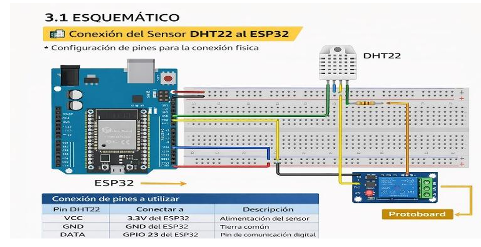
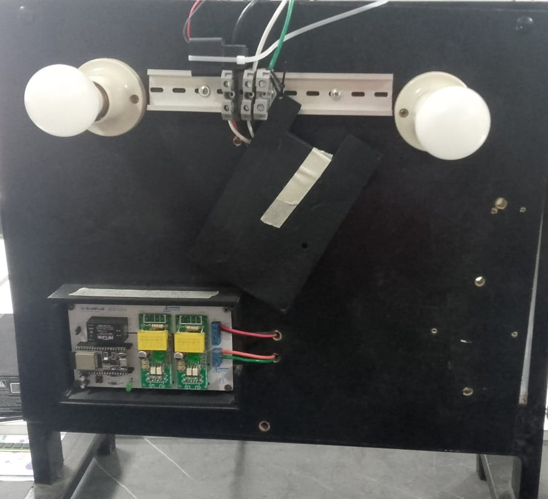
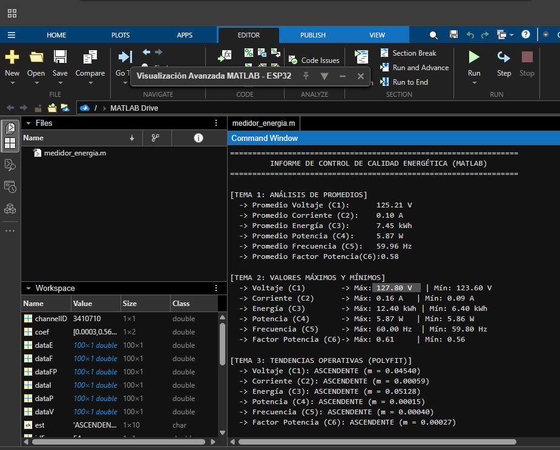
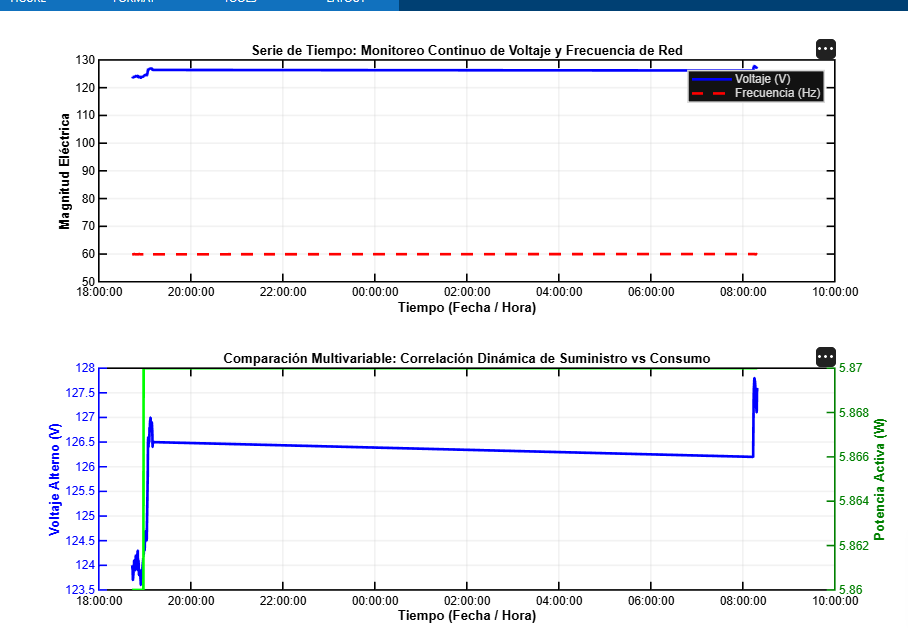

# Monitoreo y Análisis de Variables Eléctricas con ThingSpeak y MATLAB Online

## Descripción General

Este proyecto implementa una solución de Internet de las Cosas (IoT) para el monitoreo y análisis de variables eléctricas y ambientales mediante el uso de un microcontrolador ESP32, sensores de medición y la plataforma ThingSpeak integrada con MATLAB Online. El sistema fue diseñado para adquirir información en tiempo real de parámetros importantes como temperatura, humedad, voltaje, corriente, potencia y frecuencia eléctrica, permitiendo su visualización y análisis desde cualquier ubicación con acceso a Internet.

La arquitectura de la solución se basa en la captura de datos mediante un sensor DHT22 para las variables ambientales y un módulo PZEM-004T para las variables eléctricas. El ESP32 procesa la información obtenida y la transmite a la nube utilizando una conexión WiFi. Posteriormente, los datos son almacenados en ThingSpeak, donde se generan gráficos y paneles de control que facilitan la supervisión continua del sistema.

Además del monitoreo en tiempo real, la integración con MATLAB Online permite realizar análisis avanzados sobre la información recopilada. Entre las actividades desarrolladas se incluyen la generación de series temporales, el cálculo de valores máximos, mínimos y promedios, así como la identificación de tendencias y variaciones en las mediciones registradas. Estos análisis contribuyen a una mejor comprensión del comportamiento de las variables monitoreadas.


---

## Problema que Resuelve
La supervisión manual de variables eléctricas y ambientales dificulta el monitoreo continuo de los equipos y sistemas energéticos. Esta solución permite visualizar información en tiempo real desde cualquier ubicación, facilitando el análisis de datos, la detección de anomalías y la toma de decisiones.

---

## Objetivos

### Objetivo General

Desarrollar un sistema IoT para el monitoreo y análisis de variables eléctricas mediante ThingSpeak y MATLAB Online.

### Objetivos Específicos

- Monitorear variables eléctricas mediante el módulo PZEM-004T.
- Transmitir los datos a la nube utilizando el ESP32.
- Visualizar la información en tiempo real mediante ThingSpeak.
- Analizar los datos mediante MATLAB Online.
- Obtener estadísticas y tendencias de las variables monitoreadas.

---

## Arquitectura de la Solución IoT

El sistema se diseñó bajo una arquitectura clásica de tres capas (Percepcion, Red y Aplicación), la cual permite separar las funciones físicas de medición de los procesos de almacenamiento y análisis de datos en la nube.

<div align="center">
</div>

### Descripción de las Capas:

* **1. Capa de Percepcion (Edge Layer):** Es el nivel físico donde el sistema interactúa con el entorno. El módulo **PZEM-004T** mide directamente las variables de la red eléctrica (voltaje, corriente y potencia). Toda esta información es recopilada en tiempo real por el microcontrolador **ESP32**.
* **2. Capa de Red y Comunicación (Network Layer):** Se encarga del flujo y transporte de los datos. El firmware del **ESP32** opera bajo una arquitectura multitarea que le permite gestionar la conexión Wi-Fi institucional y, en paralelo, levantar un **servidor web local** (puerto 80). Esto permite al usuario realizar diagnósticos directos en la red interna en tiempo real sin interrumpir el envío de información.
* **3. Capa de Aplicación (Application Layer):** Es la sección encargada del almacenamiento y la analítica avanzada. El microcontrolador empaqueta las métricas y las transmite vía Internet hacia la plataforma cloud **ThingSpeak**. En la nube, la información se centraliza en tableros visuales interactivos (Dashboards) y se procesa mediante scripts de **MATLAB Online** para modelar perfiles de carga y predecir tendencias de consumo de manera automatizada.
---

## Componentes de Hardware Utilizados

| Componente | Descripción |
|------------|-------------|
| ESP32 | Microcontrolador de doble núcleo con conectividad WiFi y Bluetooth. |
| PZEM-004T | Medidor de energía para voltaje, corriente, potencia y frecuencia. |
| Relé de Potencia | Control remoto de cargas eléctricas. |
| Chasis ArBox | Gabinete industrial para montaje en riel DIN. |
| Optoacopladores | Aislamiento galvánico y protección eléctrica. |
| Cables Jumper | Interconexión de componentes. |
| Protoboard | Plataforma de pruebas para prototipado. |
| Fuente de Alimentación | Suministro de energía del sistema. |

---

## Componentes de Software Utilizados

- Arduino IDE
- ThingSpeak
- MATLAB Online
- GitHub
- Navegador Web

---

## Librerías Utilizadas

### WiFi.h
- Permite conectar el ESP32 a una red WiFi para la transmisión de datos.
- Enlace: https://github.com/espressif/arduino-esp32

### HTTPClient.h
- Facilita el envío y recepción de solicitudes HTTP entre el ESP32 y servicios web.
- Enlace: https://github.com/espressif/arduino-esp32

### AsyncTCP.h
- Proporciona comunicación TCP asíncrona para aplicaciones ESP32.
- Enlace: https://github.com/ESP32Async/AsyncTCP.git

### ESPAsyncWebServer.h
- Permite implementar servidores web asíncronos en ESP32.
- Enlace: https://github.com/cotestatnt/async-esp-fs-webserver.git

### PZEM004Tv30.h
- Facilita la comunicación con el módulo PZEM-004T para la lectura de variables eléctricas.
- Enlace: https://github.com/mandulaj/PZEM-004T-v30.git


---

## Tecnologías de Comunicación Implementadas

- WiFi IEEE 802.11
- HTTP
- Internet de las Cosas (IoT)
- Comunicación Serial UART entre ESP32 y PZEM-004T

---

## Plataforma IoT Empleada

### ThingSpeak

ThingSpeak fue utilizado para:

- Recepción de datos desde el ESP32.
- Almacenamiento de información en la nube.
- Visualización mediante dashboards.
- Integración con MATLAB Online.
- Análisis de datos históricos.

---

## Diagrama de Conexión o Arquitectura

<div align="center">
  
</div>
---

## Fotografías del Prototipo

<div align="center">
  
</div>

---

## Capturas del Dashboard

<div align="center">
  
</div>

---

## Capturas del Funcionamiento

### Analisis MATLAB

<div align="center">
  
</div>

### Gráficas MATLAB
<div align="center">
  
</div>
---

## Instrucciones de Instalación

### Arduino IDE

1. Instalar Arduino IDE.
2. Instalar el soporte para ESP32.
3. Instalar las librerías requeridas.
4. Conectar el ESP32 al computador mediante cable USB.

### ThingSpeak

1. Crear una cuenta en ThingSpeak.
2. Crear un nuevo canal.
3. Configurar los campos para las variables monitoreadas.
4. Obtener la Write API Key.

### MATLAB Online

1. Iniciar sesión en MATLAB Online.
2. Abrir los scripts de análisis.
3. Ejecutar los programas para procesar los datos almacenados en ThingSpeak.

---

## Instrucciones de Configuración

Configurar los parámetros de red WiFi:

```cpp
const char* wifi_ssid = "NOMBRE_WIFI";
const char* wifi_pass = "CONTRASEÑA_WIFI";
```

Configurar el punto de acceso del ESP32:

```cpp
const char* ap_ssid = "NOMBRE_AP";
const char* ap_pass = "CONTRASEÑA_AP";
```

Configurar los pines de comunicación con el módulo PZEM-004T:

```cpp
#define RXD2 16
#define TXD2 17
```

Configurar la API Key de ThingSpeak:

```cpp
const char* apiKey = "WRITE_API_KEY";
```

---

## Forma de Ejecución del Proyecto

1. Conectar el ESP32 a la red WiFi.
2. Ejecutar el programa cargado en el ESP32.
3. Verificar la recepción de datos en el Monitor Serial.
4. Confirmar el envío de información a ThingSpeak.
5. Visualizar los datos en el dashboard.
6. Ejecutar los scripts de MATLAB Online para el análisis y visualización de datos.

---

## Resultados Obtenidos

- Monitoreo en tiempo real de temperatura y humedad.
- Registro de voltaje, corriente, potencia y frecuencia eléctrica.
- Almacenamiento automático de datos en la nube.
- Generación de gráficas temporales mediante ThingSpeak.
- Análisis de datos utilizando MATLAB Online.
- Obtención de valores máximos, mínimos y promedios.
- Identificación de tendencias y comportamiento de las variables monitoreadas.

---

## Trabajos Futuros

- Implementar alertas automáticas mediante correo electrónico.
- Incorporar sensores adicionales.
- Desarrollar una aplicación móvil para monitoreo remoto.
- Integrar algoritmos de mantenimiento predictivo.
- Implementar almacenamiento en bases de datos externas.

---

## Integrantes del Grupo

- Grace Contreras Montaño
- Jersson Delgado Quintero 


---
## Licencia
Este proyecto fue desarrollado con fines académicos para la asignatura de Internet de las Cosas (IoT) de la Pontificia Universidad Católica del Ecuador Sede Esmeraldas (PUCESE).

> **MIT License**
>
> Copyright (c) 2026 Jersson Delgado, Grace Contreras
>
> Por la presente se concede permiso, de forma gratuita, a cualquier persona que obtenga una copia de este software y de los archivos de documentación asociados, para utilizar, modificar, fusionar y distribuir el código con fines educativos y de investigación, siempre que se reconozca la autoría original de los creadores.

---
## Referencias Bibliográficas
* **Bazurto, A., Asanza, V., Reyes, R., Plaza, D., & Peluffo-Ordóñez, D. H.** (19 de Noviembre de 2021). *2 PHASE ENERGY METER 100A (2PEM-100A)*. 
    * DOI: [10.21227/6f3r-t917](https://doi.org/10.21227/6f3r-t917)

* **Croucher, M.** (21 de Abril de 2026). *Se ha lanzado MATLAB R2026a: ¿Qué novedades incluye?* Blogs oficiales de MathWorks.
    * Enlace: [MathWorks Blog - MATLAB R2026a](https://blogs.mathworks.com/matlab/2026/04/21/matlab-r2026a-has-been-released-whats-new/)

* **Cyberclick.** (20 de Marzo de 2026). *¿Qué es un dashboard y para qué se usa?* Numerical Blog.
    * Enlace: [Cyberclick - Guía de Dashboards](https://www.cyberclick.es/numerical-blog/que-es-un-dashboard)

* **Mier Quiroga, L. A.** (1 de Diciembre de 2020). *ThingSpeak – La nube IoT de Matlab – Guía inicial*. BitCuco.
    * Enlace: [BitCuco - Guía Inicial ThingSpeak](https://bitcu.co/thingspeak/)
