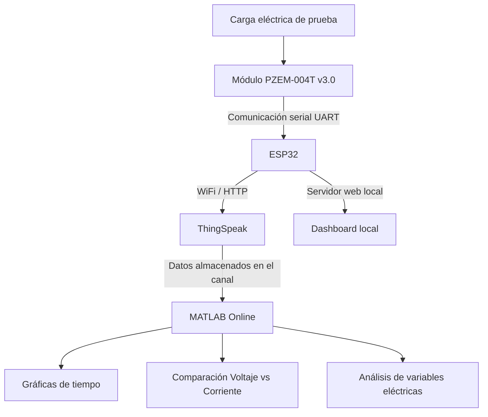
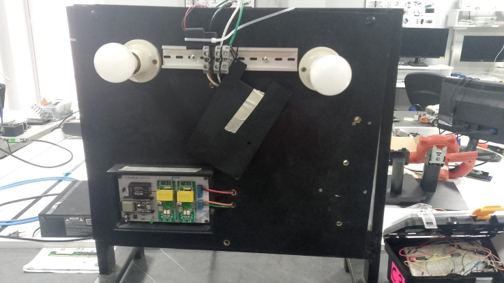

# Sistema IoT para Monitoreo de Variables Eléctricas con ThingSpeak y MATLAB Online

## Descripción general

Este proyecto consiste en el desarrollo de una solución IoT para el monitoreo de variables eléctricas mediante un **ESP32**, un módulo **PZEM-004T v3.0**, la plataforma **ThingSpeak** y herramientas de **MATLAB Online**.

El sistema permite adquirir datos de **voltaje, corriente, energía, potencia, frecuencia y factor de potencia**. Estos valores son enviados desde el ESP32 hacia ThingSpeak, donde se almacenan en un canal IoT. Posteriormente, los datos son visualizados mediante **MATLAB Visualizations**, utilizando código personalizado para generar gráficas de tiempo y comparaciones entre variables.

El proyecto también incorpora un dashboard local alojado en el ESP32, lo que permite consultar las mediciones desde una red inalámbrica creada por la placa, además de visualizar los datos en la nube mediante ThingSpeak.

---

## Problema que resuelve

El monitoreo manual de variables eléctricas puede ser limitado, poco práctico y difícil de registrar de forma continua. Además, cuando no se cuenta con una plataforma de almacenamiento, es complicado observar el comportamiento histórico de las mediciones.

Este proyecto permite automatizar la adquisición, transmisión, visualización y análisis de variables eléctricas, facilitando el seguimiento del consumo eléctrico y el comportamiento de las magnitudes medidas en tiempo real.

---

## Objetivos

### Objetivo general

Implementar un sistema IoT que permita adquirir, transmitir, visualizar y analizar variables eléctricas mediante ESP32, ThingSpeak y MATLAB Online.

### Objetivos específicos

- Capturar variables eléctricas mediante el módulo PZEM-004T v3.0.
- Enviar los datos desde el ESP32 hacia ThingSpeak mediante conexión WiFi.
- Visualizar las variables eléctricas en el canal de ThingSpeak.
- Crear gráficas personalizadas mediante MATLAB Visualizations.
- Generar gráficas de tiempo para cada variable monitoreada.
- Comparar variables eléctricas, como voltaje vs corriente.
- Documentar el proyecto en GitHub para facilitar su reutilización y mejora.

---

## Arquitectura de la solución IoT

La solución IoT está compuesta por cuatro etapas principales. Primero, el módulo **PZEM-004T v3.0** realiza la adquisición de las variables eléctricas. Luego, el **ESP32** procesa los datos recibidos mediante comunicación serial. Posteriormente, el microcontrolador envía la información hacia **ThingSpeak** mediante conexión WiFi y solicitudes HTTP. Finalmente, los datos almacenados son visualizados y analizados mediante **MATLAB Online**, utilizando gráficas personalizadas.

### Etapas del sistema

1. **Adquisición de datos:** el módulo PZEM-004T v3.0 mide las variables eléctricas.
2. **Procesamiento local:** el ESP32 recibe los datos mediante comunicación serial.
3. **Envío a la nube:** el ESP32 transmite los datos hacia ThingSpeak mediante WiFi y HTTP.
4. **Visualización y análisis:** ThingSpeak almacena los datos y MATLAB Online genera gráficas personalizadas.

### Diagrama de arquitectura



---

## Componentes de hardware utilizados

| Componente | Descripción |
|---|---|
| ESP32 DevKit | Microcontrolador encargado de recibir, procesar y enviar los datos |
| PZEM-004T v3.0 | Módulo de medición de variables eléctricas |
| Cable USB | Utilizado para programar y alimentar el ESP32 |
| Cables de conexión | Permiten conectar el ESP32 con el módulo PZEM-004T |
| Protoboard | Utilizada para organizar conexiones de bajo voltaje |
| Router WiFi | Proporciona conexión a Internet para enviar datos a ThingSpeak |
| Carga eléctrica de prueba | Elemento utilizado para generar mediciones eléctricas |
| Computador | Usado para programación, monitoreo y visualización |

---

## Componentes de software utilizados

| Software / Plataforma | Uso |
|---|---|
| Arduino IDE | Programación del ESP32 |
| ThingSpeak | Plataforma IoT para almacenamiento y visualización de datos |
| MATLAB Online | Visualización y análisis de datos almacenados |
| MATLAB Visualizations | Creación de gráficas personalizadas dentro de ThingSpeak |
| GitHub | Publicación del código y documentación técnica del proyecto |
| Navegador web | Acceso al dashboard local, ThingSpeak y MATLAB Online |

---

## Librerías utilizadas

| Librería | Función |
|---|---|
| `WiFi.h` | Permite conectar el ESP32 a una red WiFi |
| `HTTPClient.h` | Permite enviar datos hacia ThingSpeak mediante solicitudes HTTP |
| `PZEM004Tv30.h` | Permite la comunicación con el módulo PZEM-004T v3.0 |
| `AsyncTCP.h` | Permite la comunicación asíncrona para el servidor web local |
| `ESPAsyncWebServer.h` | Permite crear el dashboard web alojado en el ESP32 |

---

## Tecnologías de comunicación implementadas

| Tecnología | Descripción |
|---|---|
| WiFi | Conexión del ESP32 a Internet |
| HTTP | Envío de datos desde el ESP32 hacia ThingSpeak |
| UART / Serial | Comunicación entre el ESP32 y el módulo PZEM-004T |
| JSON | Formato usado para actualizar los datos del dashboard local |
| MATLAB `thingSpeakRead` | Lectura de datos almacenados en el canal de ThingSpeak |

---

## Plataforma IoT empleada

La plataforma IoT utilizada fue **ThingSpeak**, donde se creó un canal denominado **Medidor de Energía**. En este canal se almacenaron las variables eléctricas enviadas desde el ESP32.

### Campos configurados en ThingSpeak

| Campo en ThingSpeak | Variable | Unidad |
|---|---|---|
| Field 1 | Voltaje | V |
| Field 2 | Corriente | A |
| Field 3 | Energía | kWh |
| Field 4 | Potencia | W |
| Field 5 | Frecuencia | Hz |
| Field 6 | Factor de potencia | fp |

> **Nota importante:** no se deben publicar contraseñas WiFi, Write API Key ni claves privadas dentro del repositorio. En los archivos públicos se deben usar valores de ejemplo como `TU_WRITE_API_KEY` o `TU_READ_API_KEY`.

---

---

## Fotografías del prototipo



---

## Capturas del dashboard

### Dashboard en ThingSpeak


---

## Capturas del funcionamiento

### Gráficas de tiempo en MATLAB


### Comparación voltaje vs corriente


---

## Código fuente

El código fuente del proyecto se encuentra organizado en la carpeta `Codigo`.

### Código del ESP32

Ubicación:

```text
Codigo/ESP32/medidor_energia_esp32.ino
```

Este programa permite:

- Conectar el ESP32 a una red WiFi.
- Crear un punto de acceso local.
- Leer los datos del módulo PZEM-004T v3.0.
- Mostrar las variables en un dashboard local.
- Enviar los datos hacia ThingSpeak.
- Verificar el envío mediante el Monitor Serial.

### Código MATLAB

Ubicación:

```text
Codigo/MATLAB/
```

Archivos incluidos:

| Archivo | Descripción |
|---|---|
| `graficas_tiempo_variables.m` | Genera gráficas de tiempo para las variables eléctricas |
| `comparacion_voltaje_corriente.m` | Genera una gráfica comparativa entre voltaje y corriente |

---

## Código MATLAB para gráficas de tiempo

```matlab
% Gráficas de tiempo de variables eléctricas en ThingSpeak con MATLAB

% ID del canal ThingSpeak
channelID = 3410710;

% Clave de lectura del canal
% Si el canal es público, se puede dejar vacío.
readAPIKey = 'TU_READ_API_KEY';

% Lectura de los últimos 100 datos enviados por el ESP32
[data, timeStamps] = thingSpeakRead(channelID, ...
    'Fields', [1 2 3 4 5 6], ...
    'NumPoints', 100, ...
    'ReadKey', readAPIKey);

% Asignación de variables según los campos del canal
voltaje = data(:,1);
corriente = data(:,2);
energia = data(:,3);
potencia = data(:,4);
frecuencia = data(:,5);
factorPotencia = data(:,6);

% Creación de gráficas de tiempo
figure;

subplot(3,2,1)
plot(timeStamps, voltaje, '-o')
title('Voltaje en el tiempo')
xlabel('Tiempo')
ylabel('Voltaje (V)')
grid on

subplot(3,2,2)
plot(timeStamps, corriente, '-o')
title('Corriente en el tiempo')
xlabel('Tiempo')
ylabel('Corriente (A)')
grid on

subplot(3,2,3)
plot(timeStamps, energia, '-o')
title('Energía en el tiempo')
xlabel('Tiempo')
ylabel('Energía (kWh)')
grid on

subplot(3,2,4)
plot(timeStamps, potencia, '-o')
title('Potencia en el tiempo')
xlabel('Tiempo')
ylabel('Potencia (W)')
grid on

subplot(3,2,5)
plot(timeStamps, frecuencia, '-o')
title('Frecuencia en el tiempo')
xlabel('Tiempo')
ylabel('Frecuencia (Hz)')
grid on

subplot(3,2,6)
plot(timeStamps, factorPotencia, '-o')
title('Factor de Potencia en el tiempo')
xlabel('Tiempo')
ylabel('Factor de Potencia')
grid on
```

---

## Código MATLAB para comparación voltaje vs corriente

```matlab
% Comparación entre voltaje y corriente en ThingSpeak

% ID del canal ThingSpeak
channelID = 3410710;

% Clave de lectura del canal
% Si el canal es público, se puede dejar vacío.
readAPIKey = 'TU_READ_API_KEY';

% Lectura de los campos de voltaje y corriente
[data, timeStamps] = thingSpeakRead(channelID, ...
    'Fields', [1 2], ...
    'NumPoints', 100, ...
    'ReadKey', readAPIKey);

% Asignación de variables
voltaje = data(:,1);
corriente = data(:,2);

% Gráfica comparativa
figure;
plot(voltaje, corriente, 'o-')
title('Comparación entre Voltaje y Corriente')
xlabel('Voltaje (V)')
ylabel('Corriente (A)')
legend('Voltaje vs Corriente')
grid on
```

---

## Instrucciones de instalación

### 1. Instalar Arduino IDE

Descargar e instalar Arduino IDE desde la página oficial de Arduino.

### 2. Instalar soporte para ESP32

En Arduino IDE se debe agregar el soporte para placas ESP32 desde el gestor de tarjetas.

### 3. Instalar librerías necesarias

Desde el gestor de librerías de Arduino IDE instalar:

- `PZEM004Tv30`
- `AsyncTCP`
- `ESPAsyncWebServer`

Las librerías `WiFi.h` y `HTTPClient.h` forman parte del entorno de desarrollo para ESP32.

### 4. Clonar o descargar el repositorio

```bash
git clone https://github.com/ti-pucese/internet-de-las-cosas.git
```

### 5. Abrir el código del ESP32

Abrir el archivo:

```text
Codigo/ESP32/medidor_energia_esp32.ino
```

---

## Instrucciones de configuración

### Configuración WiFi

En el código del ESP32 se deben modificar las credenciales de la red WiFi:

```cpp
const char* ssid = "NOMBRE_DE_TU_WIFI";
const char* password = "CONTRASENA_DE_TU_WIFI";
```

### Configuración de ThingSpeak

También se debe configurar la API Key de escritura del canal:

```cpp
String writeAPIKey = "TU_WRITE_API_KEY";
```

### Configuración del canal en MATLAB

En los scripts de MATLAB se debe configurar el ID del canal:

```matlab
channelID = 3410710;
```

Si el canal es privado, se debe configurar la clave de lectura:

```matlab
readAPIKey = 'TU_READ_API_KEY';
```

Si el canal es público, puede utilizarse la lectura sin clave.

---

## Forma de ejecución del proyecto

1. Conectar el módulo PZEM-004T v3.0 al ESP32.
2. Conectar el ESP32 al computador mediante cable USB.
3. Abrir el archivo `.ino` en Arduino IDE.
4. Seleccionar la placa ESP32 correspondiente.
5. Seleccionar el puerto COM correcto.
6. Cargar el programa al ESP32.
7. Abrir el Monitor Serial.
8. Verificar que el ESP32 se conecte correctamente a la red WiFi.
9. Verificar que se muestren las variables eléctricas medidas.
10. Ingresar al canal de ThingSpeak y comprobar que los campos se actualicen.
11. Acceder a `Apps > MATLAB Visualizations`.
12. Ejecutar las visualizaciones mediante la opción `Save and Run`.
13. Comprobar las gráficas de tiempo y la comparación entre voltaje y corriente.

---

## Resultados obtenidos

Como resultado del proyecto, se logró implementar una solución IoT funcional para el monitoreo de variables eléctricas. El ESP32 recibió los datos del módulo PZEM-004T v3.0 y los envió correctamente hacia el canal de ThingSpeak.

En ThingSpeak se visualizaron las variables configuradas en los campos del canal: voltaje, corriente, energía, potencia, frecuencia y factor de potencia. Además, mediante MATLAB Online se generaron visualizaciones personalizadas que permitieron observar el comportamiento de las variables en el tiempo.

También se creó una gráfica comparativa entre voltaje y corriente, lo que permitió representar la relación entre ambas magnitudes eléctricas. Las visualizaciones incluyeron títulos, etiquetas de ejes, leyendas y cuadrícula, cumpliendo con el requisito de evidenciar el uso de MATLAB y no solamente las gráficas automáticas de ThingSpeak.

Finalmente, se verificó que los datos graficados en MATLAB correspondían a los valores enviados desde el ESP32 y almacenados en el canal de ThingSpeak.

---

## Evidencias del proyecto

| Evidencia | Ubicación |
|---|---|
| Código ESP32 | `Codigo/ESP32/medidor_energia_esp32.ino` |
| Código MATLAB de gráficas de tiempo | `Codigo/MATLAB/graficas_tiempo_variables.m` |
| Código MATLAB de comparación | `Codigo/MATLAB/comparacion_voltaje_corriente.m` |
| Fotografías del prototipo | `Imagenes/Prototipo.png` |
| Capturas de ThingSpeak | `Imagenes/Dashboard ThingSpeak.png` |
| Capturas de MATLAB | `Imagenes/MATLAB` |
| Informes técnicos | `Documentacion/` |
| Video demostrativo | `Videos/enlace_video_demostrativo.md` |

---

## Trabajos futuros

- Agregar alertas automáticas cuando el voltaje o la corriente superen valores límite.
- Incorporar almacenamiento histórico en una base de datos externa.
- Mejorar el diseño del dashboard local.
- Añadir autenticación para el acceso al dashboard web.
- Implementar análisis del consumo eléctrico por día, semana o mes.
- Integrar notificaciones mediante correo electrónico o aplicaciones móviles.
- Agregar más sensores o medidores para comparar diferentes cargas eléctricas.
- Implementar exportación automática de datos para reportes técnicos.

---

## Recomendaciones de seguridad

- No publicar contraseñas WiFi en el repositorio.
- No publicar la Write API Key de ThingSpeak.
- No compartir capturas donde aparezcan credenciales privadas.
- Usar valores de ejemplo como `TU_WRITE_API_KEY` o `TU_READ_API_KEY`.
- Trabajar con cargas eléctricas únicamente bajo supervisión técnica.
- Verificar correctamente las conexiones antes de energizar el circuito.

---

## Integrantes del grupo

- Jorel Figueroa Villegas
- Matias Holguin Ayala

---

## Docente

- Ing. Manuel Nevárez

---

## Asignatura

- Internet de las Cosas

---

## Licencia

Este proyecto fue desarrollado con fines académicos. Su uso, modificación y distribución quedan sujetos a las indicaciones de la asignatura y de la institución.

---

## Referencias bibliográficas

Arduino. (2024, 16 de abril). *Installing a board package in the IDE 2*. Arduino Documentation.  
https://docs.arduino.cc/software/ide-v2/tutorials/ide-v2-board-manager/

Arduino Libraries. (s. f.). *PZEM004Tv30*. Arduino Libraries.  
https://www.arduinolibraries.info/libraries/pzem004-tv30

Espressif Systems. (s. f.). *ESP32 Wi-Fi & Bluetooth SoC*. Espressif.  
https://www.espressif.com/en/products/socs/esp32

Espressif Systems. (s. f.). *Wi-Fi API: Arduino ESP32 documentation*. Espressif Documentation.  
https://docs.espressif.com/projects/arduino-esp32/en/latest/api/wifi.html

ESP32Async. (s. f.). *AsyncTCP*. GitHub.  
https://github.com/ESP32Async/AsyncTCP

ESP32Async. (s. f.). *ESPAsyncWebServer*. GitHub.  
https://github.com/ESP32Async/ESPAsyncWebServer

GitHub Docs. (s. f.). *About README files*. GitHub.  
https://docs.github.com/en/repositories/managing-your-repositorys-settings-and-features/customizing-your-repository/about-readmes

GitHub Docs. (s. f.). *Basic writing and formatting syntax*. GitHub.  
https://docs.github.com/github/writing-on-github/getting-started-with-writing-and-formatting-on-github/basic-writing-and-formatting-syntax

GitHub Docs. (s. f.). *Best practices for repositories*. GitHub.  
https://docs.github.com/en/repositories/creating-and-managing-repositories/best-practices-for-repositories

Mandula, J. (s. f.). *PZEM-004T-v30: Arduino library for the updated PZEM-004T v3.0 power and energy meter*. GitHub.  
https://github.com/mandulaj/PZEM-004T-v30

MathWorks. (s. f.). *ThingSpeak documentation*. MathWorks.  
https://www.mathworks.com/help/thingspeak/

MathWorks. (s. f.). *thingSpeakRead: Read data stored in ThingSpeak channel*. MathWorks.  
https://www.mathworks.com/help/thingspeak/thingspeakread.html

MathWorks. (s. f.). *thingSpeakWrite: Write data to ThingSpeak channel*. MathWorks.  
https://www.mathworks.com/help/thingspeak/thingspeakwrite.html

MathWorks. (s. f.). *MATLAB documentation*. MathWorks.  
https://www.mathworks.com/help/matlab/

MathWorks. (s. f.). *MATLAB plot gallery*. MathWorks.  
https://www.mathworks.com/products/matlab/plot-gallery.html

Pontificia Universidad Católica del Ecuador, Sede Esmeraldas. (2026). *Visualización de variables eléctricas con MATLAB en ThingSpeak: NRC6475_visualizacion_MATLAB_grupo_B* [Informe técnico académico].