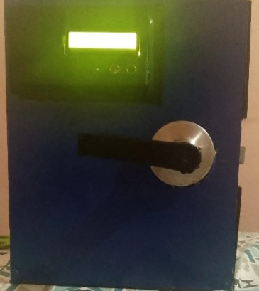
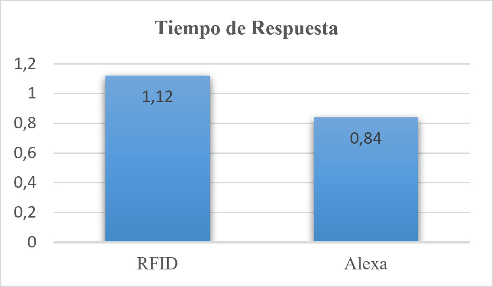
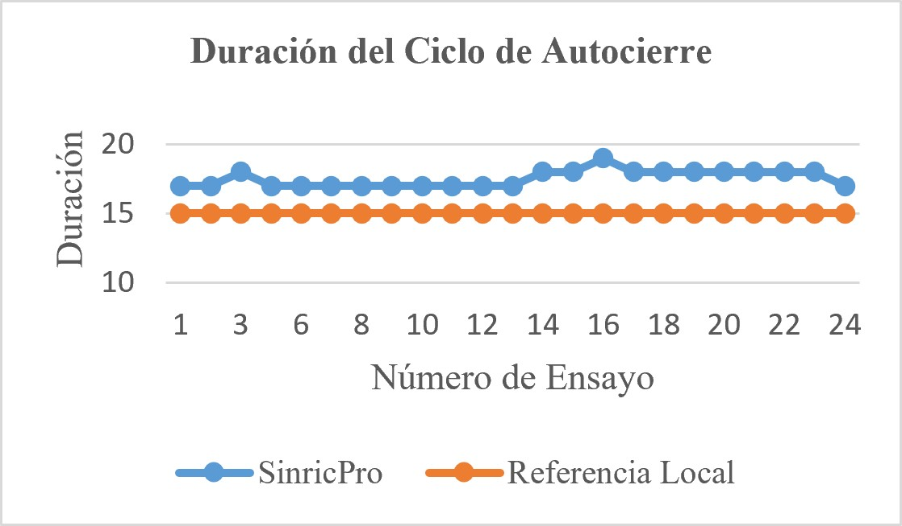

# Diseño e Implementación de un Sistema IoT de Control de Acceso Remoto para Laboratorios Universitarios Basado en ESP32 y Servicios en la Nube

## 2. Descripción del proyecto
El presente proyecto aborda las limitaciones operativas de las llaves mecánicas tradicionales en laboratorios universitarios, tales como retrasos, pérdida de llaves y la dificultad para gestionar el ingreso de los usuarios. Con el propósito de desarrollar un prototipo de control de acceso basado en Internet de las Cosas (IoT), el sistema integra autenticación presencial mediante tarjeta RFID y control remoto a través de Amazon Alexa, mejorando significativamente la seguridad y la administración de los espacios. Como solución desarrollada, se implementó un sistema embebido basado en ESP32 que agrupa autenticación RFID de 125 kHz, un servomotor para el control del pestillo, comunicación Wi-Fi mediante la plataforma SinricPro y un registro detallado de eventos. Todo este conjunto tecnológico se orienta a un contexto de aplicación enfocado en la seguridad electrónica y la automatización en laboratorios académicos.

## 3. Integrantes
* **Nombres completos:** Grace Johamy Contreras Montaño, Jersson Delgado Quintero
* **Carrera:** Tecnologías de la Información
* **Institución:** Pontificia Universidad Católica del Ecuador Sede Esmeraldas (PUCE-SE)
* **Asignatura:** Internet de las Cosas
* **Docente:** Mgt. Manuel Nevárez Toledo

## 4. Objetivos
### 4.1 Objetivo general
Diseñar e implementar un prototipo IoT de control de acceso para laboratorios académicos mediante autenticación local y administración remota.

### 4.2 Objetivos específicos
* Integrar autenticación presencial mediante lector RFID RDM6300.
* Implementar control remoto y monitoreo mediante la plataforma SinricPro y Amazon Alexa.
* Desarrollar un mecanismo de autocierre no bloqueante y registro histórico de eventos.

## 5. Arquitectura del sistema

## 6. Hardware utilizado

| Dispositivo | Modelo | Fabricante | Función | Enlace |
| :--- | :--- | :--- | :--- | :--- |
| Microcontrolador | ESP32-WROOM-32 | Espressif | Procesamiento y conectividad Wi-Fi | [Espressif](https://www.espressif.com/) |
| Lector RFID | RDM6300 | — | Identificación de credenciales (125 kHz) | — |
| Servomotor | MG996R | Tower Pro | Accionamiento mecánico del pestillo | — |
| Pantalla LCD | 16x2 I2C | — | Visualización del estado del sistema | — |
| Módulo Relé | Relé 1 canal | — | Control del estado de acceso (5V DC) | — |

## 7. Materiales y componentes
* **Fuentes de alimentación:** Módulo MB102 / XD-42 con salidas estables de 3.3V y 5V DC.
* **Protoboard:** Protoboard de 400 puntos sin soldadura.
* **Cables y conexiones:** Cables Jumper de tipo macho-macho, macho-hembra y hembra-hembra.
* **Credenciales de acceso:** Tarjetas de proximidad RFID de 125 kHz.
* **Cerradura:** Cerradura estandar adaptada mecanicamente al servomotor.
* **Estructura física:** Gabinete de soporte y protección fabricado con paneles de MDF y Alucobond para alojar los módulos, la pantalla y el sistema mecánico.

## 8. Diagrama esquemático

## 9. Códigos fuente
Todos los códigos y programas desarrollados para el funcionamiento del prototipo se encuentran almacenados y accesibles en la carpeta del repositorio:
* [Ver código fuente](codigo/PUERTA_CONTROL/PUERTA_CONTROL.ino)
* **Propósito del programa:** Gestionar la lectura del identificador mediante el lector RFID, controlar el posicionamiento PWM del servomotor, administrar el temporizador de autocierre no bloqueante mediante la función `millis()` y mantener la comunicación bidireccional por WebSockets con la plataforma SinricPro.
* **Parámetros modificables:** Es necesario actualizar en el código fuente las credenciales de la red inalámbrica (`SSID` y contraseña) junto con las claves de autenticación de la plataforma IoT (`APP_KEY`, `APP_SECRET` y `LOCK_ID`).

## 10. Librerías utilizadas
* **SinricPro / SinricProLock:** Permite la gestión de dispositivos virtuales en la nube y su vinculación con Amazon Alexa. [Repositorio oficial](https://github.com/sinricpro/esp8266-esp32-sdk.git)
* **ESP32Servo:** Utilizada para controlar con precisión la posición angular del servomotor. [Repositorio oficial](https://madhephaestus.github.io/ESP32Servo/annotated.html)
* **LiquidCrystal_I2C:** Facilita la comunicación y el despliegue visual de textos y estados en la pantalla LCD. [Repositorio oficial](https://github.com/johnrickman/LiquidCrystal_I2C.git)
* **HardwareSerial:** Empleada para gestionar la comunicación UART con el lector RDM6300.

## 11. Configuración de dispositivos
* **ESP32:** Configurado a través del entorno de desarrollo Arduino IDE empleando C++, con la placa ESP32-WROOM-32 y una velocidad de transmisión en el monitor serial fijada en 115200 baudios.
* **Lector RFID (RDM6300):** Configurado mediante interfaz UART a una velocidad de 9600 baudios.
* **Pantalla LCD:** Conectada mediante el protocolo I2C utilizando los pines GPIO 21 para SDA y GPIO 22 para SCL.
* **Servomotor:** Accionado mediante una señal de control PWM asignada al pin GPIO 18.

## 12. Plataforma IoT
* **Nombre de la plataforma:** SinricPro.
* **Función:** Servidor IoT basado en WebSockets encargado de procesar los comandos de control remoto y habilitar la compatibilidad con Amazon Alexa.
* **Configuración y variables:** Se configuró un dispositivo virtual de tipo cerradura nombrado `Puerta_ESP32`, el cual registra de forma dinámica los estados de eventos correspondientes a `Unlocked` y `Locked`.
* **Cuenta de configuración:** La plataforma SinricPro fue configurada mediante una cuenta institucional de TI-PUCESE. Las credenciales de acceso no se publican en este repositorio por motivos de seguridad.
* **Parámetros de autenticación:** Para establecer la comunicación entre el ESP32 y SinricPro se utilizan los parámetros `APP_KEY`, `APP_SECRET` y `LOCK_ID`, los cuales deben configurarse en el código fuente.
> ⚠️ **Nota:** Las credenciales de la cuenta institucional deben solicitarse al responsable del proyecto
* 🔗 **Enlace de acceso al Dashboard (Evidencia):** [Ver panel de control en línea](evidencias/sinricpro_dashboard_puerta.png)
## 13. Configuración paso a paso

> **Nota:** Para consultar los pines, conexiones de alimentación y distribución de los componentes, revisar el [diagrama esquemático](hardware/Esquematico.png).

- **Paso 1:** Preparar el hardware base y posicionar los componentes electrónicos sobre la protoboard.

- **Paso 2:** Realizar el cableado y las conexiones eléctricas principales, estableciendo la distribución de las líneas de alimentación y GND desde las fuentes correspondientes hacia los módulos.

- **Paso 3:** Conectar el lector RFID RDM6300 al ESP32 mediante la interfaz UART, siguiendo las conexiones indicadas en el diagrama esquemático. Alimentar el módulo con 5 V y asegurar una tierra común (GND).

- **Paso 4:** Conectar la pantalla LCD 16x2 I2C al ESP32 utilizando las conexiones SDA, SCL, VCC y GND indicadas en el diagrama esquemático.

- **Paso 5:** Conectar la señal de control PWM del servomotor MG996R al ESP32 y alimentar el servomotor mediante una fuente externa adecuada, manteniendo una tierra común (GND).

- **Paso 6:** Instalar y configurar el entorno de desarrollo Arduino IDE junto con el paquete de soporte para placas ESP32.

- **Paso 7:** Descargar e instalar las librerías necesarias para el funcionamiento del proyecto: `SinricPro`, `ESP32Servo` y `LiquidCrystal_I2C`.

- **Paso 8:** Abrir el código ubicado en [`codigo/PUERTA_CONTROL/PUERTA_CONTROL.ino`](codigo/PUERTA_CONTROL/PUERTA_CONTROL.ino) y modificar los parámetros correspondientes a la red Wi-Fi y a la plataforma SinricPro. Las credenciales reales deben mantenerse privadas y no deben publicarse en el repositorio.

- **Paso 9:** Seleccionar en Arduino IDE la placa ESP32 correspondiente y el puerto de comunicación. Compilar el programa y, si no existen errores, cargarlo en el microcontrolador.

- **Paso 10:** Abrir el Monitor Serial a `115200` baudios y verificar la inicialización del sistema. Posteriormente, acercar una tarjeta RFID autorizada al lector y comprobar que la identificación sea reconocida correctamente.

- **Paso 11:** Configurar la integración de SinricPro con Amazon Alexa mediante la Skill correspondiente y asociar el dispositivo virtual `Puerta_ESP32` para permitir el control mediante comandos de voz.

- **Paso 12:** Acoplar y posicionar físicamente el servomotor MG996R en el mecanismo de la cerradura o pestillo. Ajustar su posición para garantizar que los movimientos de apertura y cierre se realicen correctamente.

- **Paso 13:** Integrar y ensamblar el circuito y los mecanismos dentro de la estructura protectora fabricada en MDF y Alucobond, verificando que los componentes queden firmemente sujetos y que el mecanismo pueda realizar su recorrido sin obstrucciones.

- **Paso 14:** Realizar las pruebas finales de funcionamiento, comprobando la lectura de tarjetas RFID autorizadas, el bloqueo y desbloqueo, el control remoto mediante SinricPro y Amazon Alexa, la actualización del estado en la pantalla LCD y el funcionamiento del autocierre automático.
  
## Resultados de las pruebas

  
  
  

## 14. Video de presentación

  

  🎥 <strong>Ver video de presentación del proyecto en YouTube</strong>

[🎥 Ver video de presentación del proyecto en YouTube](https://youtu.be/f8vocLhxorY)

## 15. Referencias
* Las fuentes bibliográficas y los 10 artículos científicos de soporte (correspondientes al periodo 2022-2026) que sustentan el desarrollo de este proyecto se encuentran organizados y disponibles dentro de la carpeta `/referencias/` del repositorio.
* [📚 Ver referencias del proyecto](referencias)
