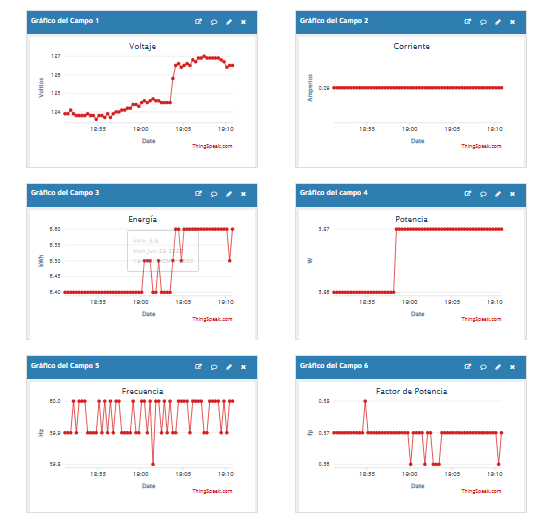

# Creación y configuración de un canal en ThingSpeak para el monitoreo de energía eléctrica mediante IoT

## Descripción General

Este proyecto documenta el proceso de creación, configuración e implementación de un canal en **ThingSpeak** de MathWorks para el monitoreo de variables eléctricas mediante Internet de las Cosas (IoT).
El procedimiento comprende desde la creación de una cuenta institucional y su validación, hasta la configuración del canal, la habilitación de los campos de monitoreo, la personalización de los gráficos y la publicación del dashboard para acceso público. La plataforma permite almacenar los datos enviados por un medidor inteligente de energía eléctrica, visualizarlos en tiempo real y analizarlos posteriormente mediante **MATLAB Online**.

---

## Problema que Resuelve

La supervisión manual de variables eléctricas dificulta el monitoreo continuo y el acceso remoto a la información. Mediante ThingSpeak es posible almacenar, visualizar y consultar los datos desde cualquier lugar con acceso a Internet, facilitando el análisis histórico y la toma de decisiones.

---

## Objetivos

### Objetivo General

Implementar un canal de monitoreo en ThingSpeak para el almacenamiento y visualización de variables eléctricas.

### Objetivos Específicos

- Crear una cuenta institucional en ThingSpeak.
- Configurar un canal de monitoreo.
- Habilitar los campos para almacenar las variables eléctricas.
- Personalizar los gráficos del dashboard.
- Publicar el canal para acceso público.
- Integrar el canal con MATLAB Online para el análisis de datos.

---

## Plataforma Utilizada

### ThingSpeak

La plataforma fue utilizada para:

- Crear el canal de monitoreo.
- Almacenar información en la nube.
- Visualizar datos mediante gráficos.
- Compartir el dashboard de forma pública.
- Integrar el canal con MATLAB Online.

---

## Materiales Utilizados

- Cuenta activa en ThingSpeak (MathWorks).
- Computadora portátil o de escritorio.
- Navegador web (Google Chrome, Microsoft Edge o similar).
- Conexión a Internet.
- Correo electrónico institucional.
- MATLAB Online.

---

## Configuración de la Plataforma

### Dashboard

https://thingspeak.mathworks.com/channels/3410710

### Información del Canal

| Parámetro | Valor |
|-----------|-------|
| Plataforma | ThingSpeak |
| Channel ID | **3410710** |
| Author ID | **mwa0000028022737** |
| Write API Key | **write_apy** |
| Read API Key | **read_apy** |

---

## Creación y Configuración del Canal

### Paso 1. Creación del canal

Desde la sección **My Channels** se creó un nuevo canal denominado **Medidor de Energía**.

---

### Paso 2. Configuración de los campos

Se habilitaron los seis campos destinados al almacenamiento de las variables eléctricas:

- Voltaje
- Corriente
- Energía
- Potencia
- Frecuencia
- Factor de Potencia

---

### Paso 3. Personalización de las gráficas

Cada gráfico fue configurado asignando el nombre correspondiente a la variable monitoreada.

---

### Paso 4. Verificación del funcionamiento

Se verificó que el canal recibiera correctamente la información y que las gráficas mostraran la actualización de los datos en tiempo real.

---

### Paso 5. Publicación del canal

Finalmente se habilitó la opción **Share Channel View with Everyone**, permitiendo que el dashboard sea visible públicamente.

---

## Capturas del Dashboard

---

## Resultados Obtenidos

- Se creó correctamente una cuenta institucional en ThingSpeak.
- Se configuró un canal para el monitoreo de variables eléctricas.
- Se habilitaron seis campos para el almacenamiento de datos.
- Se personalizaron las gráficas del dashboard.
- Se verificó el almacenamiento continuo de la información.
- Se habilitó el acceso público al canal.
- Se confirmó la integración con MATLAB Online para el análisis de datos.
## 🎥 Video demostrativo

---
## Trabajos Futuros

- Implementar alertas automáticas mediante correo electrónico.
- Incorporar sensores adicionales.
- Desarrollar una aplicación móvil para monitoreo remoto.
- Integrar algoritmos de mantenimiento predictivo.
- Implementar almacenamiento en bases de datos externas.

---

## Integrantes del Grupo

- Grace Contreras Montaño
- Jersson Delgado Quintero 

---
## Licencia
Este proyecto fue desarrollado con fines académicos para la asignatura de Internet de las Cosas (IoT) de la Pontificia Universidad Católica del Ecuador Sede Esmeraldas (PUCESE).

> **MIT License**
>
> Copyright (c) 2026 Jersson Delgado, Grace Contreras
>
> Por la presente se concede permiso, de forma gratuita, a cualquier persona que obtenga una copia de este software y de los archivos de documentación asociados, para utilizar, modificar, fusionar y distribuir el código con fines educativos y de investigación, siempre que se reconozca la autoría original de los creadores.

---
## Referencias Bibliográficas
* **Bazurto, A., Asanza, V., Reyes, R., Plaza, D., & Peluffo-Ordóñez, D. H.** (19 de Noviembre de 2021). *2 PHASE ENERGY METER 100A (2PEM-100A)*. 
    * DOI: [10.21227/6f3r-t917](https://doi.org/10.21227/6f3r-t917)

* **Croucher, M.** (21 de Abril de 2026). *Se ha lanzado MATLAB R2026a: ¿Qué novedades incluye?* Blogs oficiales de MathWorks.
    * Enlace: [MathWorks Blog - MATLAB R2026a](https://blogs.mathworks.com/matlab/2026/04/21/matlab-r2026a-has-been-released-whats-new/)

* **Cyberclick.** (20 de Marzo de 2026). *¿Qué es un dashboard y para qué se usa?* Numerical Blog.
    * Enlace: [Cyberclick - Guía de Dashboards](https://www.cyberclick.es/numerical-blog/que-es-un-dashboard)

* **Mier Quiroga, L. A.** (1 de Diciembre de 2020). *ThingSpeak – La nube IoT de Matlab – Guía inicial*. BitCuco.
    * Enlace: [BitCuco - Guía Inicial ThingSpeak](https://bitcu.co/thingspeak/)
