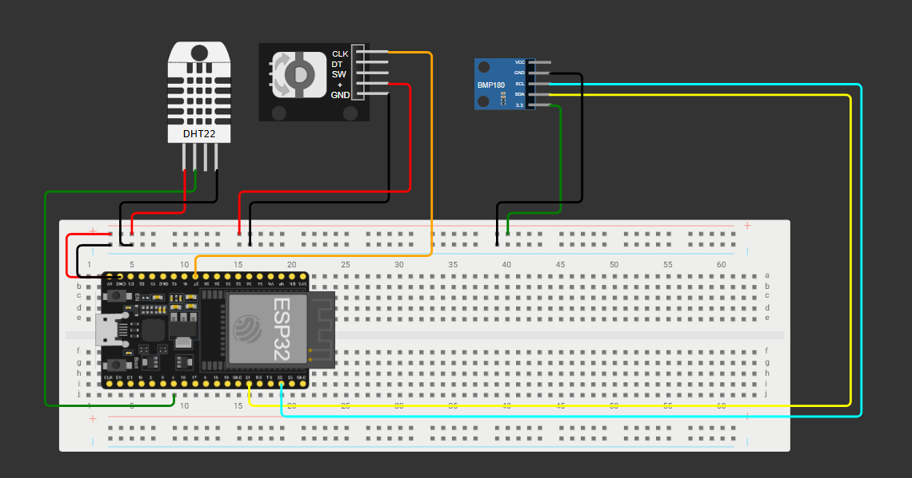
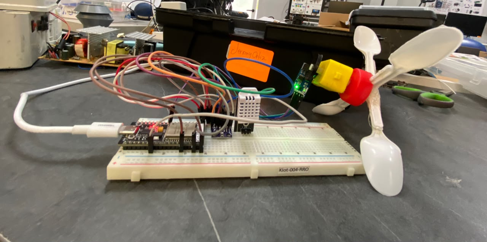
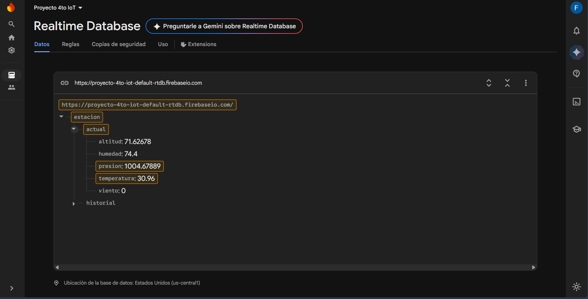
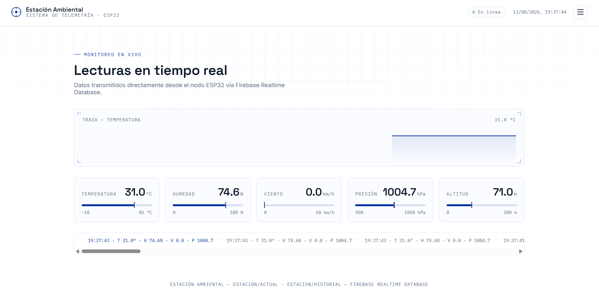

# Estación Ambiental · Telemetría IoT 

## 1. Descripción
El presente proyecto consiste en una estación meteorológica de telemetría IoT diseñada para el monitoreo en tiempo real de variables ambientales. El sistema resuelve la necesidad de recolectar datos precisos (temperatura, humedad, presión, altitud y velocidad del viento) en ubicaciones remotas, procesarlos localmente y enviarlos a la nube para su visualización remota a través de un dashboard web interactivo. 

## 2. Integrantes
* **Nombre:** Jostin Figueroa, Argei Realpe, Jermy Ortiz
* **Carrera:** Tecnologías de la Información 
* **Institución:** Pontificia Universidad Católica del Ecuador Sede Esmeraldas
* **Asignatura:** Internet de las Cosas
* **Docente:** Manuel Nevárez

## 3. Objetivos
* **Objetivo General:** Desarrollar e implementar un sistema IoT funcional para la captura, transmisión y visualización en tiempo real de datos meteorológicos utilizando un microcontrolador ESP32 y Firebase.
* **Objetivos Específicos:**
  * Integrar múltiples sensores en un solo nodo de procesamiento.
  * Establecer una comunicación segura y estructurada con Firebase Realtime Database.
  * Diseñar una interfaz web interactiva para la lectura del clima y el análisis de gráficas temporales.

## 4. Arquitectura del sistema
Sensores (DHT22, BMP280, Anemómetro) ➡️ Microcontrolador (ESP32) ➡️ Comunicación (Wi-Fi) ➡️ Plataforma IoT (Firebase RTDB) ➡️ Visualización (Web HTML/JS + Chart.js)

## 5. Hardware utilizado

| Dispositivo | Modelo | Fabricante | Función |
| :--- | :--- | :--- | :--- |
| Microcontrolador | ESP32 (WROOM-32) | Espressif | Procesamiento y conexión Wi-Fi |
| Sensor Temperatura/Humedad | DHT22 | Aosong | Medición de temp. y humedad relativa |
| Sensor Presión/Altitud | BMP280 | Bosch | Medición barométrica |
| Sensor Velocidad | Encoder Rotativo | Varios | Cálculo de velocidad del viento (km/h) |

## 6. Materiales y componentes adicionales
* 1x Protoboard
* Cables Jumper (M-M, M-H)
* Fuente de alimentación (Cable MicroUSB/USB-C 5V)

## 7. Diagrama esquemático
 

## 8. Librerías utilizadas (Arduino IDE)
* `WiFi.h`: Integrada en el core del ESP32. Para conexión de red.
* `Firebase_ESP_Client` (por Mobizt): Comunicación con Firebase. [GitHub](https://github.com/mobizt/Firebase-ESP-Client)
* `DHT sensor library` (por Adafruit): Lectura del DHT22. [GitHub](https://github.com/adafruit/DHT-sensor-library)
* `Adafruit_BMP280_Library`: Lectura del BMP280 por I2C. [GitHub](https://github.com/adafruit/Adafruit_BMP280_Library)
* `WebServer.h`: Para levantar el servidor local de diagnóstico.

## 9. Configuración de dispositivos
**ESP32:**
1. Instalar el core de ESP32 en Arduino IDE.
2. Seleccionar la placa "DOIT ESP32 DEVKIT V1" (o la correspondiente).
3. Configurar los baudios del Monitor Serie a `115200`.

**Plataforma IoT (Firebase):**
1. Crear un proyecto en Firebase y habilitar **Realtime Database**.
2. Habilitar el método de autenticación por **Correo y Contraseña**.
3. Configurar las reglas de la base de datos para escritura privada (`auth != null`) y lectura pública (`true`).
4. La base de datos recibe actualizaciones continuas en el nodo `estacion/actual` y realiza *pushes* periódicos con marca de tiempo en `estacion/historial`.

## 10. Configuración paso a paso
1. **Hardware:** Conectar el DHT22 al GPIO4, el BMP280 a los pines I2C (SDA 21, SCL 22) y el encoder al GPIO27.
2. **Software (Nube):** Crear credenciales en Firebase (Web API Key, URL de la DB y usuario de autenticación).
3. **Software (Nodo):** Abrir `nodo_esp32.ino`, colocar las credenciales de red Wi-Fi y Firebase en las directivas `#define` y subir el código al ESP32.
4. **Software (Dashboard):** Abrir el archivo `index.html`, asegurarse de que el bloque `firebaseConfig` coincide con el proyecto creado, y ejecutarlo en cualquier navegador web.

## 11. Evidencias del proyecto
* Fotografía del prototipo

* Captura del dashboard de firebase

* Captura del dashboard web

## 12. Video de presentación
* **Enlace:** [Vídeo](https://youtu.be/D_lCXdVXEX4)
* **Descripción:** Demostración del funcionamiento en tiempo real, recolección de datos y actualización del dashboard web interactivo.

## 13. Referencias y recursos
* [Documentación Oficial ESP32](https://docs.espressif.com/projects/esp-idf/en/latest/esp32/)
* [Firebase Web SDK documentation](https://firebase.google.com/docs/web/setup)
* [Chart.js Documentation](https://www.chartjs.org/docs/latest/)